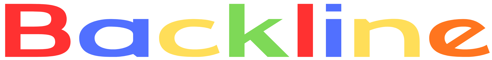

# Backline

<p align="center">
  
</p>

<p align="center">
  <strong>NYC's network for musicians.</strong><br>
  Find gigs, gear, collaborators, and opportunities nearby.
</p>

<p align="center">
  
  
  
  
</p>

---

## Overview

Backline is a mobile platform built for local music scenes.

Musicians often rely on fragmented channels like Instagram DMs, Craigslist posts, group chats, and word of mouth to find opportunities. Backline consolidates those workflows into one dedicated app designed for creators.

Starting in New York City, Backline helps users:

* Find bandmates and collaborators
* Discover gigs and opportunities
* Buy and sell music gear
* Build a local network
* Move faster inside their scene

---

## Why Now

The creator economy expanded, but local musicians still use outdated infrastructure.

There is no category-defining mobile product focused on the real-world needs of city-based music communities. Backline is designed to fill that gap.

---

## Core Features

## Musician Profiles

Create identity-driven profiles with:

* Instruments
* Genres
* Experience level
* Bio
* Media links
* Availability

## ISO Board

Users can post requests such as:

* Need drummer for Friday show
* Looking for bassist in Brooklyn
* Need vocalist for studio session
* Seeking photographer for live set

## Gear Marketplace

Local buying and selling for:

* Guitars
* Synths
* Interfaces
* Pedals
* Drum hardware
* DJ equipment

## Direct Messaging

Fast communication between musicians, buyers, sellers, and collaborators.

## Hyperlocal Discovery

Built city-first, starting with NYC neighborhoods and scenes.

---

## Product Vision

Backline aims to become the operating system for local music communities.

Launch city by city:

1. New York City
2. Los Angeles
3. London
4. Chicago
5. Toronto
6. Global niche scenes

---

## Tech Stack

### Frontend

* Swift
* SwiftUI
* Xcode

### Backend

* Firebase Authentication
* Cloud Firestore
* Firebase Storage
* Firebase Cloud Messaging

### Planned Infrastructure

* Recommendation engine
* Venue dashboards
* Promoter tools
* Event graph / discovery ranking

---

## Local Setup

## Requirements

* macOS
* Xcode latest version
* Apple Developer account (for device builds / push notifications)
* Firebase project

## Installation

```bash
git clone https://github.com/deejcoding/backline.git
cd backline
open backline.xcodeproj
```

## Firebase Setup

1. Create Firebase project
2. Register iOS bundle identifier
3. Download `GoogleService-Info.plist`
4. Add file to Xcode project root
5. Enable:

* Authentication
* Firestore
* Storage
* Cloud Messaging

---

## Current Status

Backline is in active beta development.

Current priorities:

* Stable onboarding funnel
* Push notification reliability
* Marketplace liquidity
* User retention loops
* NYC early community growth

---

## Growth Strategy

Backline is designed to scale through dense local networks.

Initial wedge:

* NYC independent musicians
* Producers
* DJs
* Bands
* Photographers
* Venues
* Promoters

Once density forms, network effects strengthen naturally.

---

## Roadmap

## Phase 1

* Profiles
* ISO board
* Messaging
* Marketplace MVP

## Phase 2

* Event listings
* Audio embeds
* Verified venues
* Search + saved alerts

## Phase 3

* Monetization tools
* Premium accounts
* Team pages
* Multi-city rollout

---

## Contributing

Private project currently under active development.

If you are interested in contributing, partnerships, testing, or early access, reach out directly.

---

## Founder Note

Backline was created from a simple belief:

Local music scenes deserve better software.

---

## License

All rights reserved.
